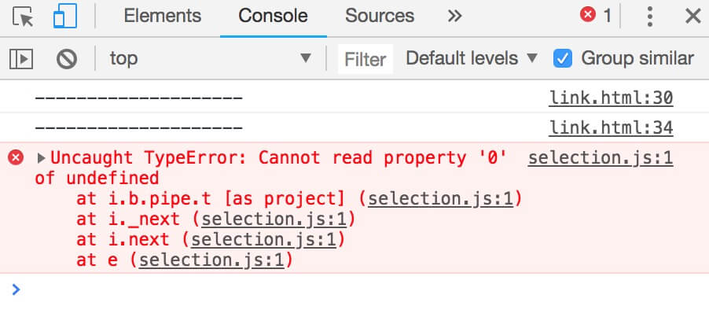

# 『EVENT』一次 debug 过程
## 问题
某次在实践 dispatchEvent 时遇到个奇怪的问题
``` html
<div id="t">t</div>
<script>
  console.log('--------------------')
  setTimeout(function () {
    document.getElementById('t').dispatchEvent(new Event('touchend'))
  }, 1000)
  console.log('--------------------')
</script>
```
我的环境
>macOS: Version 10.13.6 (17G65)
>
>chrome: Version 68.0.3440.106 (Official Build) (64-bit)

console 一直出现一个 error，但是在 safari 和 codepen 中都无法重现，并且不在 setTimeout 中调用时没有发生，并且 dispatch 的事件不为 touchend 时也没有发生。



## 解决
- 更新 chrome 到最新版本 `Version 69.0.3497.81 (Official Build) (64-bit)` 未解决，并且 google 之并没有发现相似问题的，推测不是 chrome 的问题；
- 那么我的 safari 和 chrome 环境有哪些不同？想到了安装的拓展不同，将鼠标移到 selection.js 上，出现了之前忽视的文件路径 `chrome-extension://cdonnmffkdaoajfknoeeecmchibpmkmg/selection.js`，问题找到了。
查看 `chrome://extensions/`，打开 `Developer mode` 后显示了安装的每个 extension 的 ID，与上述 ID 一致的为 Saladict 6.13.4，这是一个划词翻译工具，关闭后刷新页面，问题解决。

## TODO
研究 saladict 源码。
