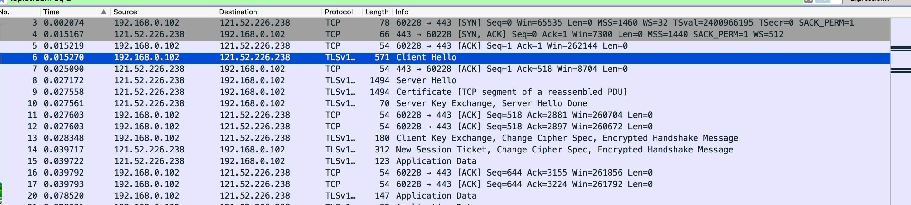

# https
HTTPS = HTTP + SSL/TLS，默认端口 443，TCP 三次握手 + SSL 四次握手

## ssl 过程
SSL(Secure Socket Layer) 是 TLS(Transport Layer Security) 的前身，SSL 从 3.1 开始被标准化并改名为 TLS

ssl / tls 握手的过程就是为了协商出一个安全的对称密钥，基本步骤如下
- client: hello
- server: hello 给你一个证书
- client: 查过了 ssl 是真的, 得到 pub_key
- client: pub_key 加密(对称加密算法 + 对称密钥)
- server: private_key 解密，得到(对称加密算法 + 对称密钥)，后续采用对称密钥加密通话

具体的实现涉及 tls 不同版本稍有出入，通过 `wireshark` 查看了访问 upyun 的过程

1. client: Client Hello(随机数 + 客户端支持的加密算法 + session ID)
2. server: Server Hello(随机数 + 确定使用的加密算法)
3. server: Certificate 证书
4. server: Server Key Exchange(EC Diffie-Hellman Server Params 中有 curve、pubkey 和 signature) + Server Hello Done
5. client: Client Key Exchange(根据给定的 DH 算法得出的 pubkey) + Change Cipher Spec(接下来只发加密消息) + Encrypted Handshake Message(发个加密消息你看能解吗)
5. server: New Session Ticket(给你一个 session ticket 来维持我们的友谊) + Change Cipher Spec(同上) + Encrypted Handshake Message(同上)
6. 之后都是加密后的 Application Data 通信

其中第一步的 session id 可以在中断后快速恢复连接，不需要再次握手进行密钥协商

## SSL 证书验证 
证书内容
- CA
- 有效期
- 公钥
- 所有者
- 签名

浏览器验证证书首先会：判断有效期；比对内置的受信 CA；`[incomplete]`
<!-- 取出操作系统中 CA 的公钥对证书签名进行解密；比对证书的 hash 值 -->

浏览器验证证书链的方式

- CRL 维护并定时更新证书撤销名单
- OCSP 实时在线证书验证协议
- OCSP stapling 服务器模拟客户端验证，将 OCSP 响应和证书链一起下发给客户端，因此浏览器不需要再想 CA 站点查询证书状态
